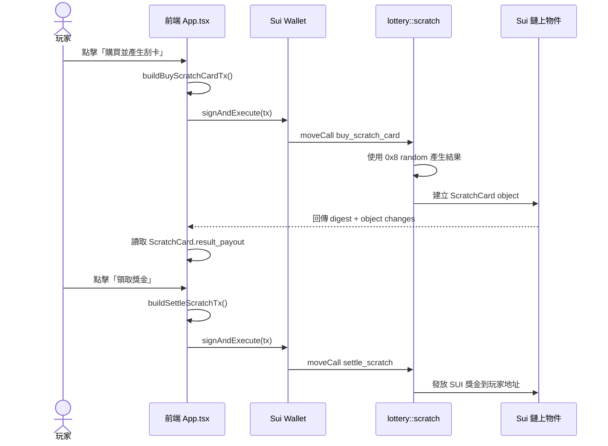
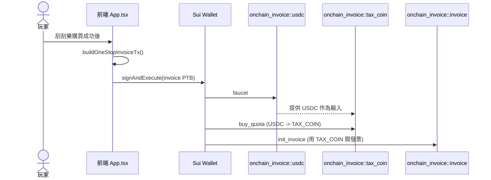

# Sui 幸運抽籤（BermuDAO 黑客松）

語言：
- 英文版：[README.md](README.md)
- 繁體中文版（本檔）
- 評審操作腳本：[HACKATHON_JUDGE_FLOW.zh-TW.md](HACKATHON_JUDGE_FLOW.zh-TW.md)

**台灣刮刮樂遊玩現已整合 Sui 隨機數模組 (0x8)，符合黑客松 +10 加分條件。**

這是一個用於 Sui Sprout 參賽的前端 + Move 合約專案，包含：

- 台灣刮刮樂流程（購買、刮開、揭曉、領獎）
- 玩家等級倍率（Sprout / Bloom / Bermu Pro / Sui Master）
- **Move 合約整合官方隨機數** (`new_generator`, `generate_u32`)
- 交易簽署層已就緒，可執行鏈上調用

## 技術棧

- **前端：** React 18 + TypeScript + Vite
- **區塊鏈：** Sui dApp Kit + @mysten/sui/transactions
- **智能合約：** Move (edition 2024.beta) 搭配 sui::random
- **官方模組：** `0x2` (Framework) + `0x8` (Randomness)

## 快速開始

1. 安裝依賴

```bash
npm install
```

2. 建立環境變數檔

```bash
copy .env.example .env
```

設定：
- `VITE_SUI_NETWORK=testnet`
- `VITE_SUI_FULLNODE_URL=<testnet_endpoint>`
- `VITE_SUI_FRAMEWORK_PACKAGE_ID=0x2`
- `VITE_SUI_RANDOM_PACKAGE_ID=0x8`

3. 啟動開發伺服器

```bash
npm run dev
```

4. 生產編譯

```bash
npm run build
```

## 官方 Package 串接說明（白話版）

這個專案其實同時串了 4 種「Package / Object」：

1. **Sui 官方 Framework (`0x2`)**
2. **Sui 官方 Randomness (`0x8`)**
3. **你自己部署的 Lottery Package (`VITE_LOTTERY_PACKAGE_ID`)**
4. **官方提供的 onchain_invoice Package (`VITE_INVOICE_PACKAGE_ID`)**

可以先把它想成：
- `0x2`、`0x8` 是「官方提供的底層能力」
- `VITE_LOTTERY_PACKAGE_ID` 是「你自己寫的刮刮樂主流程」
- `VITE_INVOICE_PACKAGE_ID` 是「官方提供的鏈上發票與抽獎模組」

### 1) 環境變數負責「指到哪一個 package」

前端在 `.env` 讀這幾個值：

- `VITE_SUI_FRAMEWORK_PACKAGE_ID=0x2`
- `VITE_SUI_RANDOM_PACKAGE_ID=0x8`
- `VITE_LOTTERY_PACKAGE_ID=0x...`（你 publish 後拿到）
- `VITE_LOTTERY_OBJECT_ID=0x...`（ScratchLottery shared object）

其中：
- `VITE_LOTTERY_PACKAGE_ID` 決定前端實際呼叫哪個 Move module/function
- `VITE_LOTTERY_OBJECT_ID` 決定操作哪一個遊戲池實例

### 2) 前端實際「串接點」在哪裡

前端交易都集中在 `src/utils/transactions.ts`，核心是 `tx.moveCall({ target: ... })`：

- 買刮卡：`{packageId}::scratch::buy_scratch_card`
- 領獎結算：`{packageId}::scratch::settle_scratch`
- 管理員充值：`{packageId}::scratch::top_up`
- 管理員提領：`{packageId}::scratch::withdraw`

這裡的 `{packageId}` 就是 `.env` 的 `VITE_LOTTERY_PACKAGE_ID`。

### 3) App 流程怎麼用到它

`src/App.tsx` 的流程是：

1. 先用 `getContractIds()` 讀環境變數
2. `buyScratchCard()` 呼叫 `buildBuyScratchCardTx()`
3. 錢包簽署送出後，等待鏈上回執並抓新建的 `ScratchCard` object
4. 玩家刮卡完成後，`claimPrize()` 呼叫 `buildSettleScratchTx()` 完成鏈上結算

所以你在畫面按「購買 / 領獎」，底層就是在打你部署的 Lottery package function。

### 4) 官方 Randomness (`0x8`) 到底做了什麼

真正的隨機是在 Move 合約 `contracts/lottery/sources/lottery.move` 內執行：

- `draw_winning_odds()`：抽這張卡的中獎倍率
- `create_board()`：產生 9 格內容、決定是否放入 jackpot 標記

兩者都透過：
- `sui::random::new_generator(random, ctx)`
- `sui::random::generate_u32(&mut gen)`

也就是說：
- 前端只負責發交易
- 「中不中獎」與「盤面內容」是在鏈上用官方 Randomness 決定
- 玩家不能在前端竄改結果

### 5) 你可以怎麼驗證自己有串對

1. `.env` 已填入正確 `VITE_LOTTERY_PACKAGE_ID`、`VITE_LOTTERY_OBJECT_ID`
2. 購買時，錢包跳出交易，且 digest 成功
3. 鏈上可看到 `::scratch::buy_scratch_card` 被呼叫
4. 領獎時，鏈上可看到 `::scratch::settle_scratch` 被呼叫
5. Move 合約中確定有使用 `sui::random::*`（代表用官方 0x8）

### 6) 你剛提供的「官方 onchain_invoice package」在做什麼

這份 package（`contracts/onchain_invoice_repo/onchain_invoice/sources`）主要是發票與抽獎加分流程，和刮刮樂主遊戲是兩條並行線：

- `usdc.move`
	- `faucet()`：發測試用 USDC
- `tax_coin.move`
	- `buy_quota()`：把 USDC 轉成 TAX_COIN（程式內是 1:10）
- `invoice.move`
	- `init_invoice()`：用 TAX_COIN 開立一張鏈上發票
	- `lottery()`：抽出本期中獎發票編號（使用 `sui::random`）
	- `claim_lottery()`：中獎者憑發票到 `treasury` 領 USDC
- `treasury.move`
	- `input()` / `output()`：管理 USDC 獎池

前端對應在 `src/utils/transactions.ts`：

- `buildFaucetUsdcTx()` -> `::usdc::faucet`
- `buildBuyQuotaTx()` -> `::tax_coin::buy_quota`
- `buildInitInvoiceTx()` -> `::invoice::init_invoice`
- `buildOneStopInvoiceTx()`：把上面三步合併成一個 PTB

在目前 `src/App.tsx` 中，玩家買刮卡成功後，會嘗試觸發 `buildOneStopInvoiceTx()`（失敗也不影響主遊戲）。

### 7) 呼叫順序圖（前端 -> Move -> 鏈上結果）

主遊戲（刮刮樂）流程：



官方 onchain_invoice 流程（加分功能）



一句話總結：
前端主線是呼叫你部署的 Lottery package 玩刮刮樂；你補的官方 onchain_invoice package 是額外的鏈上發票/抽獎流程，兩者都能共享 Sui 官方模組能力（含 `0x8` 隨機數）。

## 智能合約

Move 合約已成功編譯✅，功能包括：

- **buy_scratch_card()** - 使用 Sui 隨機數產生 9 宮格刮卡
- **settle_scratch()** - 驗證並向玩家錢包發放獎金  
- **new_round()** - 業主控制的輪次推進
- **官方隨機數整合** (sui::random::{new_generator, generate_u32})

## 前端交易層

`src/utils/transactions.ts` 交易工具已實現，接下來部署合約後即可連接。

## 黑客松檢查清單

- ✅ 台灣刮刮樂遊玩實現
- ✅ Sui 隨機數模組 (0x8) 整合
- ✅ 官方 Package ID 顯示與使用
- ✅ Move 合約編譯成功
- ✅ 交易層已就緒
- ✅ 雙語 UI (EN + 繁中)
- [ ] Testnet 部署

## 下一步

1. **部署** Move 合約至 testnet
2. **領取** Package ID + Object ID
3. **測試** Testnet 端對端
4. **提交** 至黑客松